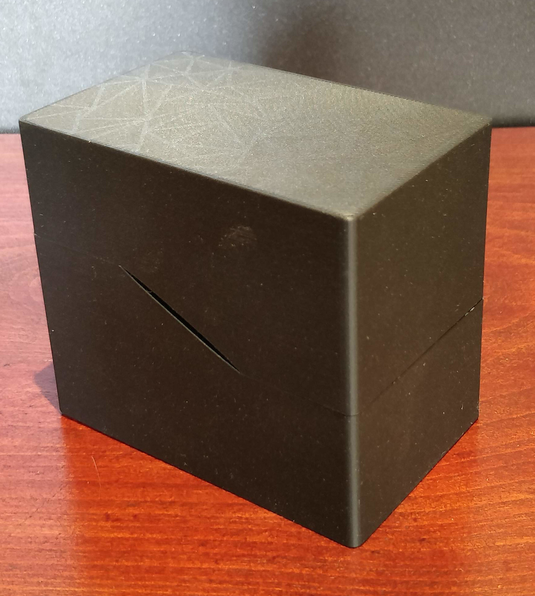

# NFC Box

A simple blocky NFC card box - A 3D printable storage solution for NFC cards.

## Features

- Simple and minimalist blocky design
- Fits standard NFC/RFID cards (85.5mm x 54mm)
- Easy to print with common materials such as PLA
- No supports needed
- Can hold up to 80 cards
- Gimp template file for printing stickers for the cards

## Preview

Closed box:

Open box with sample cards:

## Print Settings

- **Layer Height:** 0.15mm
- **Infill:** 10%
- **Material:** PLA
- **Support:** No
- **Print Time:** *printing times are given for a Prusa mini*
	- base : 4h30 
	- lid : 3h30
	- separator : [add print time here]

## Files Included

- `nfc-box.stl` - Main box model
- `nfc-box-lid.stl` - Lid model

## License

This project is licensed under the GNU General Public License v3.0 - see the [LICENSE](LICENSE) file for details.

## Author

etnsid

## Contributing

Contributions are welcome! Please feel free to fork this repository and create the awesome box you'll love!

